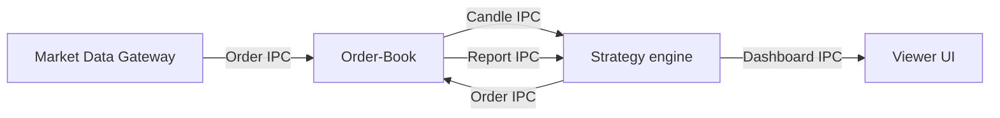

# HFT Core: Ultra-Low Latency C++ Trading Engine

A modular, high-frequency trading (HFT) infrastructure built in C++. It utilizes **Shared Memory (IPC)** and **Lock-Free Ring Buffers** to achieve nanosecond-level latency and throughput exceeding 100 million orders per second.

## 🚀 Performance Benchmarks

The system operates at the speed of the CPU cache, effectively removing software overhead.

| Metric | Result | Meaning |
| :--- | :--- | :--- |
| **Tick-to-Trade Latency** | **~26 nanoseconds** | The time it takes for the Strategy to read a price, calculate indicators, and decide to buy. For context, light travels only ~7.8 meters in this time. |
| **Engine Throughput** | **~101 Million Orders/sec** | The number of orders the system can transport and ingest locally. This is significantly faster than any crypto exchange matching engine (which typically handle 100k-500k/sec). |

**Conclusion:** The software stack is no longer the bottleneck. The speed limit is now determined exclusively by the Network Latency (Internet) and the Exchange's API limits.

---

## 🏗 System Architecture

The project is decoupled into independent processes that communicate via **Memory Mapped Files (`/dev/shm`)**. This allows the Strategy and Engine to run on separate CPU cores without context-switching overhead.


### To run

```bash
./run.sh
```
this will build and then run the program.


## After downloading
If you want to change the strategy that is used go to the main.cpp in /strategy/src/main.cpp
Here you can add pretty much anything


# Strategy Framework – Minimal Wiki

This is a C++ backtesting framework built around:

- Engine
- Ring_buffer
- Indicator (base class)
- SMA (soon to have more)
- User-defined Strategy (overridden logic)

This document only covers what is essential to understand and extend the system.

---

# Engine

The Engine is the core runtime of the framework.

## Purpose

- Holds account balance
- Tracks positions
- Executes orders
- Owns the Ring_buffer
- Runs the main loop

## Constructor

```cpp
Engine(double starting_balance, double trading_fee);
```

### Parameters

- starting_balance – Initial capital
- trading_fee – Fee per trade (fractional)

## Important Methods

```cpp
void connect();
void run();
Ring_buffer& get_ring_buffer();
void order(double quantity, double price, Order_side side, bool reduce_only);
```

### connect()
Initializes data feed or simulation source.

### run()
Main loop:
- Updates market data
- Pushes new candles into Ring_buffer
- Calls strategy logic

### order(...)
Executes a trade.

Arguments:
- quantity – Size of trade
- price – Execution price
- side – BUY or SELL
- reduce_only – Prevents increasing exposure

---

# Ring_buffer

A fixed-size circular buffer storing recent candles.

## Purpose

- Stores historical price data
- Enables indicator calculations

## Important Methods

```cpp
Candle& get(size_t index);
void push(const Candle& candle);
size_t size() const;
```

### Access Pattern

- get(0) → Most recent candle
- get(1) → Previous candle
- Oldest values are overwritten automatically

---

# Indicator (Base Class)

All indicators inherit from this.

Indicators read from a shared Ring_buffer.

## Static Setup

```cpp
Indicator::set_ring_buffer(engine.get_ring_buffer());
```

Must be called before indicators are used.

---

# SMA (Simple Moving Average)

Derived from Indicator.

## Constructor

```cpp
SMA(size_t period);
```

## Method

```cpp
double calculate();
```

## Behavior

- Reads last period values from Ring_buffer
- Returns arithmetic mean
- Requires sufficient buffer size before valid output

---

# Strategy (User Overridden Class)

This is where trading logic lives.

You define your own strategy class and run logic using indicators and the engine.

## Example Skeleton

```cpp
class Strategy {
    SMA short_ma { 3 };
    SMA long_ma  { 12 };

public:
    void run(Ring_buffer& rb, Engine& engine) {

        if (rb.size() < 12)
            return;

        double price = rb.get(0).get_open();

        double short_val = short_ma.calculate();
        double long_val  = long_ma.calculate();

        if (short_val > long_val) {
            engine.order(1.0, price, Order_side::BUY, false);
        }
        else if (short_val < long_val) {
            engine.order(1.0, price, Order_side::SELL, false);
        }
    }
};
```

## Responsibilities

- Read market data from Ring_buffer
- Compute indicators
- Make decisions
- Send orders through Engine

---

# Typical Flow

```cpp
int main() {
    Engine engine(100000.0, 0.0001);

    Indicator::set_ring_buffer(engine.get_ring_buffer());

    engine.connect();
    engine.run();

    return 0;
}
```

Flow:

1. Engine created
2. Indicators linked to buffer
3. Data feed connected
4. Engine loop runs
5. Strategy logic executes each update

---

# Minimal Rules To Make It Work

- Always call Indicator::set_ring_buffer(...)
- Ensure enough candles exist before calculating indicators
- Only place orders through engine.order(...)
- Strategy logic must be deterministic per tick
